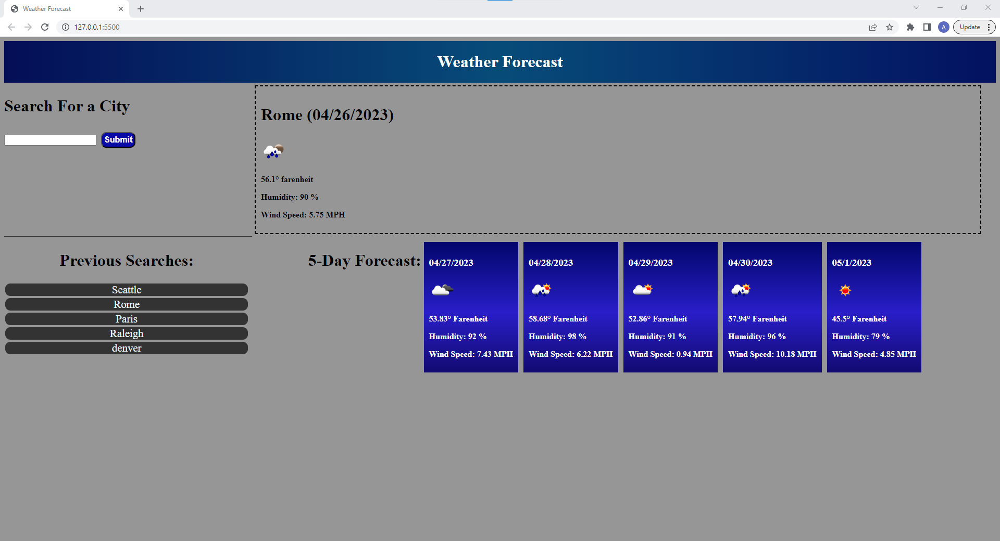

# weather-forecast
## Description
This is a weather forecast. This webpage allows a user to input a city of their choice and see current and future weather data on that city. It also allows them to revisit previously searched cities.

## Installation
N/A
## Usage
Upon load the user will be able to input a city of their choice into the searchbar and hit submit. once they do they will be presented with various wether data for that city. Current weather complete with City name, current date, temperature, humidity, and wind speed will be available. the same weather info will also be displayed below for future dates, in the form of a 5-day forecast. The city the user entered will also be saved in local storage and displayed on the page in the form a button. If the user ever wishes they can click the same city from previous cities, and once again display weather info for that city without having to search the city again.
https://ashleybraxton.github.io/weather-forecast/

## License

MIT